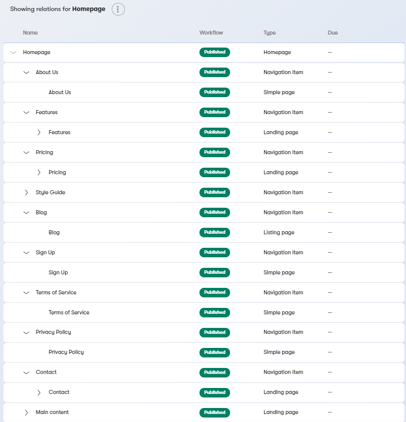
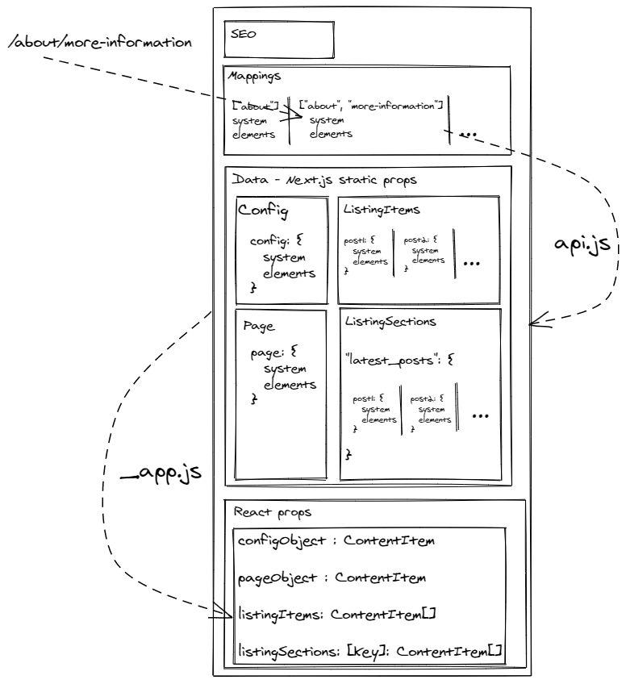
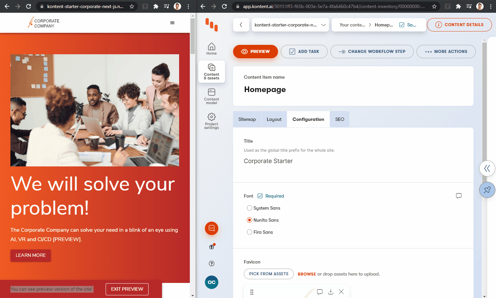
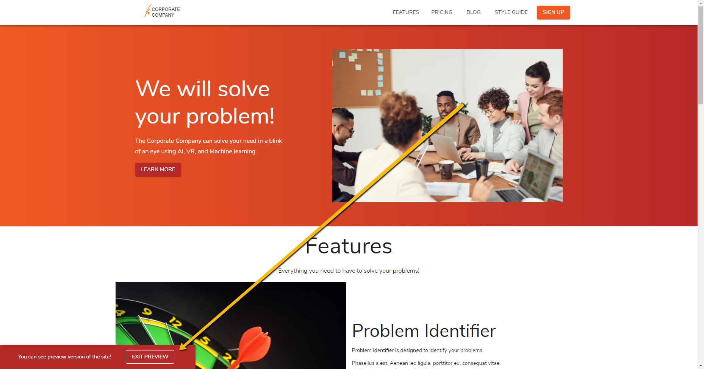
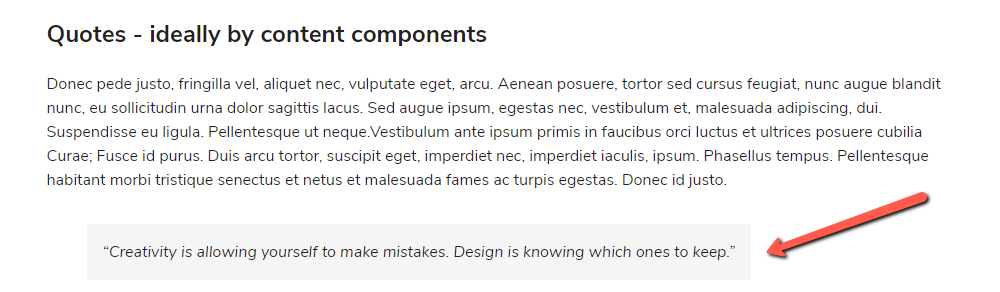

# Kontent Starter Corporate - Next.js

[](https://github.com/Kentico/kontent-starter-corporate-next-js/actions/workflows/main.yml)
[](https://app.netlify.com/sites/kontent-starter-corporate-next-js/deploys)

[](https://github.com/Kentico/Home/discussions)
[](https://stackoverflow.com/tags/kentico-kontent)

This is a [Next.js](https://nextjs.org) corporate starter site using [Kentico Kontent](https://kontent.ai) as a [CMS](https://en.wikipedia.org/wiki/Content_management_system).

## Demo

<https://kontent-starter-corporate-next-js.netlify.app/>

[](https://kontent-starter-corporate-next-js.netlify.app)

## Deploy your own

Once you have access to [the environment variables you'll need](#environment-variables), deploy the example using [Vercel](https://vercel.com?utm_source=github&utm_medium=readme&utm_campaign=next-example):

[](https://vercel.com/new/git/external?repository-url=https://github.com/Kentico/kontent-starter-corporate-next-js&project-name=kontent-starter-corporate-next-js&repository-name=kontent-starter-corporate-next-js&env=KONTENT_PROJECT_ID,KONTENT_PREVIEW_API_KEY&envDescription=Required%20to%20connect%20the%20app%20with%20Kontent&envLink=https://github.com/Kentico/kontent-starter-corporate-next-js%23Environment-variables)

## How to use

Execute [`create-next-app`](https://github.com/vercel/next.js/tree/canary/packages/create-next-app) with [npm](https://docs.npmjs.com/cli/init) or [Yarn](https://yarnpkg.com/lang/en/docs/cli/create/) to bootstrap the example:

```bash
npx create-next-app --example https://github.com/Kentico/kontent-starter-corporate-next-js kontent-starter-corporate-next-js
# or
yarn create next-app --example https://github.com/Kentico/kontent-starter-corporate-next-js kontent-starter-corporate-next-js
```

### Environment variables

1. Set up environment variables

   - Copy the `.env.template` file in this directory to `.env` (which will be ignored by Git):

     ```sh
     cp .env.template .env
     ```

2. Run the development server

   ```sh
   npm run dev
   # or
   yarn dev
   ```

🎉 Open [http://localhost:3000](http://localhost:3000) with your browser to see the result.

> By default, the content is loaded from a shared Kentico Kontent project. If you want to use your own clone of the project so that you can customize it and experiment with Kontent, continue to the next section.

|        Variable         | Required | Description                                                                                                                                            |
| :---------------------: | :------: | :----------------------------------------------------------------------------------------------------------------------------------------------------- |
|   KONTENT_PROJECT_ID    |   YES    | Project identification described in the [Setup section](#connect-kontent-project-with-code-base)                                                      |
| KONTENT_PREVIEW_API_KEY |    NO    | Project key allowing to load non-published content described in the [Setup](#connect-kontent-project-with-code-base) and [Preview](#preview) sections |
|     PREVIEW_SECRET      |    NO    | A key securing the preview content access via application described in [Preview entering section](#enter-the-preview)                                   |
|      STATIC_EXPORT      |    NO    | If you choose to [Static export of your site](#static)                                                                                                 |

## Create your own data source project in Kontent

### Create Kontent project

1. Create an account on Kontent
   - [Create an account on Kontent.ai](https://app.kontent.ai/sign-up?utm_source=nextjs_boilerplate_example&utm_medium=devrel).
2. After signing up, [create an empty project](https://docs.kontent.ai/tutorials/set-up-kontent/projects/manage-projects#a-creating-projects).
3. Go to the "Project Settings", select API keys and copy the following keys for further reference
   - Project ID
   - Management API key
4. Use the [Template Manager UI](https://kentico.github.io/kontent-template-manager/import) for importing the content from [`kontent-backup.zip`](./kontent-backup.zip) file and API keys from the previous step. Check _Publish language variants after import_ option before import.

   > Alternatively, you can use the [Kontent Backup Manager](https://github.com/Kentico/kontent-backup-manager-js) and import data to the newly created project from [`kontent-backup.zip`](./kontent-backup.zip) file via command line:
   >
   > ```sh
   >  npm i -g @kentico/kontent-backup-manager
   >  # or
   >  yarn global add @kentico/kontent-backup-manager
   >
   >  kbm --action=restore --projectId=<Project ID> --apiKey=<Management API key> --zipFilename=kontent-backup
   > ```
   >
   > Go to your Kontent project and [publish the imported items](https://docs.kontent.ai/tutorials/write-and-collaborate/publish-your-work/publish-content-items).

### Connect Kontent project with code base

1. Set env variables on `.env`:
   - `KONTENT_PROJECT_ID` - Should be the Project ID in `Project settings` > `API keys`.
   - `KONTENT_PREVIEW_API_KEY` - Should be the Preview API key in `Project settings` > `API keys`. Set this value if you want to see non-published content. If you need a more complex setup, jump to the [Preview section](#Preview).

## Content editing development

Run the development server:

```sh
npm run dev
# or
yarn dev
```

🎉 Open [http://localhost:3000](http://localhost:3000) with your browser to see the result.

You can start editing the page by modifying content in Kentico Kontent project. The page auto-updates as you edit the content. If you don't have `KONTENT_PREVIEW_API_KEY` specified, you need to [publish the changes](https://docs.kontent.ai/tutorials/write-and-collaborate/publish-your-work/publish-content-items) in order to see the changes on site.

## About

This section describes the application from the data modeling point of view as well as application architecture approach.

### Content model

Content is modeled to be ready for being used in the [Web Spotlight](webspotlight.kontent.ai). Web spotlight is not turned on by default intentionally, because this starter should also serve to the users without the feature on.



> The screen was taken from [Relations UI](https://docs.kontent.ai/tutorials/write-and-collaborate/structure-your-content/link-related-content-together#a-see-how-your-content-is-linked-together). For a better idea, check out the [content type relationships graph](./docs/content-types-relations.png).

### Structural types

The structure of the model is defined by linked items element called "Subpages"

- Homepage - also stores configuration data like color palette, font specification, site logo, or social networks information
  - Navigation Item - mainly for defining the sitemap structure with the slugs.

### SEO

SEO information is [modeled as a content type snippet called "SEO"](https://docs.kontent.ai/tutorials/develop-apps/optimize-your-app/seo-friendly-content#a-metadata-in-caas).

This snippet is placed as a part of [structural types](#structural-types). Every sitemap entry (the content item based on structural types and a `post`) allows specifying SEO metadata. This metadata is used in a [custom App components (`_app`)](https://nextjs.org/docs/advanced-features/custom-app) component to be rendered on the page.

### Layout types

Content for these structural wrappers is defined by linked items element called "Content" with limitation to exactly one item of the type:

- **Simple page** - This content type is mapped to the [simple_page.js](./layouts/simple_page.js). It is a simple page, containing title, subtitle, image and content.
- **Landing page** - This content type is mapped to the [landing_page.js](./layouts/landing_page.js). The more complex page consists of sections (see [/components/sections](./components/sections)).
- **Listing page** - This content type is mapped to the [listing_page.js](./src/layouts/listing_page.js). This page allows to specify which content types should be listed under it. Currently, the only supported in Post content type.

> These types are then using specific layouts for rendering.

### Turn on Web Spotlight

When you turn on the [Web Spotlight](https://docs.kontent.ai/tutorials/set-up-kontent/set-up-your-project/web-spotlight). New content types ["Homepage" and "Page"](https://docs.kontent.ai/tutorials/set-up-kontent/set-up-your-project/web-spotlight#a-how-web-spotlight-works) will be generated. In order to accommodate the content types, it is required to:

- Remove the Page content type, because its responsibilities are handled by "Navigation Item" content type.
- Transfer content model structure from "old" homepage content type to newly created one. The only difference is the "Subpages" element that will be modeled by [Subpages](https://docs.kontent.ai/tutorials/set-up-kontent/content-modeling/what-is-content-modeling#a-subpages) element type. It is important to keep the codenames of the element the same.
- Transfer the data from old "homepage".
- Remove the "old" homepage content item and the "old" content type and set the new homepage content item codename to "homepage".

> These steps are easily scriptable by creating a migration using [Kontent CLI](https://github.com/Kentico/kontent-cli). To see the progress of including it to this starter, follow [this issue](https://github.com/Kentico/kontent-starter-corporate-next-js/issues/4).

## Code

The application is using Next.js [Catch all route](https://nextjs.org/docs/routing/dynamic-routes#catch-all-routes) to handle all of the routes. The logic is centralized in [`pages/[[...slug]].js`](./src/pages/[[...slug]].js).

### Data loading



> #### ⚠ Benefits and drawbacks
>
> ##### Benefits
>
> Described [sitemap construction](#sitemap-construction) and [configuration loading from Home Page structural type](#structural-types) suits better for projects being built from scratch. In these situations, you need to have the sitemap and configuration (pallette, font, etc.) flexible and easily manageable from the headless CMS without necessity to change the code. This gives you flexibility to spin up the website and configure the project with No Code.
>
> [](https://www.headlesscreator.com/how-to-spin-up-a-nextjs-project-with-no-code)
>
> 
>
> ##### Drawbacks
>
> This approach requires to make 2 requests per route to reload `Mappings` and `Config` objects. This additional work takes a couple of seconds for the development environment to spin up. For the production build, the results are still fast enough.
>
> If you already know the configuration values and the sitemap structure, it is better to use [Next.js dynamic routes](https://nextjs.org/docs/routing/dynamic-routes) showcased in [Next.js Kontent blog repository](https://github.com/vercel/next.js/tree/canary/examples/cms-kontent#readme), but the approach used for [RichText links resolution](#rich-text-element-resolution), [Preview URLs](#preview-urls) and [Web Spotlight setup](#turn-on-web-spotlight) has to be adjusted to respect this new way of routing.

#### Sitemap construction

To define the sitemap and its mapping to specific content items there is `getContentPaths` method in [lib/api.js](./lib/api.js). Internally it uses `getSitemapMappings` method which loads "homepage" item and its child items to the specific depth and then traverses down. This process creates a mapping between the sitemap (routes) and the content items storing data for the specific route.

One example item from the sitemap mappings:

```js
{
  params: {
    slug: ["about", "more_information"],
    navigationItem: {
      id: "ABC",
      codename: "lorem",
      type: "navigation_item",
      language: "default",
      collection: "default",
      // whole system information
    },
    contentItem: { // could be same i.e. for blog posts
      id: "XYZ",
      codename: "ipsum",
      type: "simple_page",
      language: "default",
      collection: "default",
      // whole system information
    },
  }
}
```

#### Specific route data

For every single route, Next.js is loading data using the `getPageStaticPropsForPath` method. Internally, it reloads the site structure via `getSitemapMappings` method and then identifies the content items to load the data. Then loads the raw data using Delivery client and `getRawKontentItemSingleResult/getRawKontentItemListingResult` methods and passes them as the **static** `props` to the Next.js processing.

Static props returned from `getPageStaticPropsForPath`:

```js
{
  // seo title, description, ....
  seo,
  // URL -> CONTENT ITEM mapping from above
  mappings,

 // RAW DATA FROM KONTENT
  data: {
    // data for layout (font, header logo, color palette, ...)
    config,
    // main content of the page
    page,
    // if the `page` is a `listing_page` type - linked items are passed in this item
    listingItems,
    // if any section of the page is a `listing_section` related items are stored there in the dictionary under the codename of the listing section content item
    listingSections
  },
};

```

The data passed as **static Next.js** `props` are then transformed in `_app.js` by `hydrateContentItemSingleResponse/hydrateContentItemListingResponse` methods into the Kontent Javascript SDK `ContentItem` objects and then passed down as the React props:

```jsx
const configObject = hydrateContentItemSingleResponse(pageProps.data.config);
const pageObject = hydrateContentItemSingleResponse(pageProps.data.page);
const listingSections = Object.fromEntries(
  Object.entries(pageProps.data.listingSections).map(([key, value]) => [
    key,
    hydrateContentItemListingResponse(value),
  ])
);
const listingItems = Object.fromEntries(
  Object.entries(pageProps.data.listingItems).map(([key, value]) => [
    key,
    hydrateContentItemListingResponse(value),
  ])
);

// ...

<Component
  {...pageProps}
  configObject={configObject}
  pageObject={pageObject}
  listingSections={listingSections}
  listingItems={listingItems}
/>;
```

- `configObject: ContentItem` - data for layout (font, header logo, color palette, ...) stored in [HomePage content type](#structural-types)
- `pageObject: ContentItem` - **main content of the page** - item based on one of the [Layout types](#layout-types) linked in "Content" linked item element in Home page/Navigation item.
- `listingItems: ContentItem[]` - if the `pageObject` is a `listing_page` - this object linked items are configured to be displayed (via `content_type`, `order` and `limit` element stored in the listing page item)
- `listingSections: { [listing_section_codename] : ContentItem[] }` - if the `pageObject` is a `landing_page` and contains `listing_section` section(s) - this object contains linked items configured to be displayed in the `listing_section` (via `content_type`, `order` and `limit` element stored in the listing section item).

> Currently, the sitemap is reloaded for every request. The following approach was selected because there is currently no way to pass more information than just a path from `getStaticPaths` to `getStaticProps`. See [the official Next.js GitHub discussion comment](https://github.com/vercel/next.js/issues/10933#issuecomment-598297975) for more information.
> It is possible to extend the implementation with the caching, this approach is about to be application specific, so it is not part of the starter.

### Content types - React components mapping

Application is using the codename of the content type to load proper react component and render it. If the application does not find the proper component, it fails or displays [special UnknownComponent](./components/UnknownComponent.js) in case of development environment.

```jsx
const componentName = upperFirst(camelCase(get(section, "system.type", null)));

const Component = sections[componentName];

if (process.env.NODE_ENV === "development" && !Component) {
  console.error(
    `Unknown section component for section content type: ${contentType}`
  );
  return (
    <UnknownComponent key={section_idx} {...this.props}>
      <pre>{JSON.stringify(section, undefined, 2)}</pre>
    </UnknownComponent>
  );
}

return <Component key={section_idx} {...props} section={section} />;
```

Reference:

- [Layout mapping](./pages/[[...slug]].js)
- [Landing page sections mapping](./layouts/landing_page.js)
- [Footer sections mapping](./components/Footer.js)
- [Thumbnail mapping](./layouts/listing_page.js)

## Preview

Next.js offers embedded possibility to preview unpublished content - [the preview mode](https://nextjs.org/docs/advanced-features/preview-mode). This feature is integrated with [Kontent preview](https://docs.kontent.ai/tutorials/develop-apps/build-strong-foundation/set-up-preview) in this starter. Once the preview is enabled, all api calls are performed to the [Kontent Preview endpoints](https://docs.kontent.ai/reference/delivery-api#section/Production-vs.-Preview).

There are two Next API routes - `/api/preview` and `/api/exit-preview` - that works as described in [Next.js docs](https://nextjs.org/docs/advanced-features/preview-mode).

### Enter the preview

To enter the preview, just access `/api/preview` API route with the preview secret you set in your [environment variables](#environment-variables).

`http://localhost:3000/api/preview?secret=PREVIEW_SECRET`

> If you don't have your `PREVIEW_SECRET` [environment variable](#environment-variables) set, your preview is not secured and could be accessed by anybody. Read more on [Official Next.js docs](https://nextjs.org/docs/advanced-features/preview-mode#securely-accessing-it-from-your-headless-cms).

Once your secret is verified, you will be redirected to home page and you could see non-published content and the toolbar that allows you to exit the preview.



#### Preview URLs

Kentico Kontent [offers a possibility to set the preview URLs for the content types](https://docs.kontent.ai/tutorials/develop-apps/build-strong-foundation/set-up-preview#a-set-up-content-preview-in-your-project). The starter (`/api/preview` route) is already prepared to consume this preview URLs for [structural types](#structural-types) and for the `Post` content type.

To allow that for your project, just set the Preview URLs for `Navigation item`, `Homepage`, and `Post` content type to (fill values in angle brackets):

```plain
https://<YOUR-HOST-DOMAIN>/api/preview?secret=<PREVIEW_SECRET>&redirectItemCodename={Codename}
```

### Exit the preview

Once the preview is enabled a new toolbar pops up on the top of the page. This allows to close the preview (the "EXIT PREVIEW" button leads to the `/api/exit-preview` API route).

## Publish process and data fetching

Next.js provides [multiple ways to fetch the data](https://nextjs.org/docs/basic-features/data-fetching). This starter is mainly focused to be used in two of these modes. Incremental static regeneration and static export.

### Incremental Static regeneration (ISR)

This approach serves well for most of the use cases. Application is generated as static HTML and then re-hydrating React components with JSON data objects. It supports [Preview](#preview) functionality. The publishing process with [incremental static regeneration](https://nextjs.org/docs/basic-features/data-fetching#incremental-static-regeneration) ensures that the new content is propagated in the background and once it is ready, the application starts to serve it instead of the stale content. Revalidation period is set to 5s as you can see on `getStaticProps` method in `[[...slug]].js` component.

This deployment requires a place to run Node.js code. Since the starter target configuration is set to `serverless` (see [`next.config.js` file information](https://nextjs.org/docs/api-reference/next.config.js/introduction)), it is possible to use lambda functions to run this server code. This fits the Next.js recommended provider [Vercel](https://vercel.com/). But you could use i.e. [Netlify](https://www.netlify.com/) in combination with the [netlify-plugin-next-js](https://github.com/netlify/netlify-plugin-nextjs#readme), or any other cloud provider and configure lambdas the same way as Netlify plugin does. The second option is to switch the target to the `server` and use a Node.js server deployed to any of your cloud providers.

To run this locally, run following commands:

```sh
yarn build
yarn start
```

### Static

It is possible to pre-generate all site and deploy it right to the CDN without the necessity to have a place to run Node.js code (lambda function/server). This removes the option of having the content up-to-date out-of-the-box when your content changes as well as preview functionality. You need to set up the webhooks and their handlers, that regenerate the site and re-deploy the generated content to your CDN for both released and preview content.

⚠ To be able to run the export, the site has to be built [without fallback pages](https://nextjs.org/docs/messages/ssg-fallback-true-export). The starter is turning the fallback pages on unless the `STATIC_EXPORT` environment variable is set to `true`.

To generate the site locally, run fun following command:

```sh
yarn static-export
```

### *Server-side rendering*

> It is also possible to use this starter for [server-side rendering](https://nextjs.org/docs/basic-features/data-fetching#getserversideprops-server-side-rendering), it requires you to implement `getServerSideProps` in [Next.js Page component](https://nextjs.org/docs/basic-features/pages), but as the Next.js [documentation states](https://nextjs.org/docs/basic-features/data-fetching#when-should-i-use-getserversideprops) - *"You should use `getServerSideProps` only if you need to pre-render a page whose data must be fetched at request time" - and that is not the primary requirement for this starter.*
>
> If you want to see the example checkout [What’s the best place to host Next.js site?
](https://kontent.ai/blog/comparison-of-jamstack-hosting-platforms-for-next-js) by [Ondřej Polesný](https://github.com/@ondrabus).

## Rich text element resolution

A [Rich text element](https://docs.kontent.ai/reference/delivery-api#section/Rich-text-element) could carry more than just a text. It could contain links, images, components, and inline linked items. The starter offers a `/style-guide` section to showcase the options to resolve complex structure into the React components.

The `/style-guide` is a page based on the `simple_page` layout containing title, sub, and the content in a form of a rich text element. This rich text element contains a showcase of various typographical examples (headlines, lists, tables) and also images, components, and links to other content items. To parse and resolve them, there is a pair of components. The first one is `RichTextComponent` containing the parsing logic (using [`html-react-parser`](https://www.npmjs.com/package/html-react-parser) library) and offering the possibility to implement the resolution. And the second one defining the resolution logic from rich text blocks to React Components - the `RichText` component.

The usage is simple. To resolve the rich text element, you place the `RichText` component and provide a rich text element object and then propagate all other props used to load appropriate data (linked items data, information about mapping to be able to resolve URL to specific content item).

```jsx
<RichText
  {...props} // Used to load mappings and linked items data
  richTextElement={get(page, "content", null)}
/>
```

In `/style-guide`, you can see these results.

Rich Text Component



Rich Text Image


Rich Text Component


> 💡 You could use a different approach to resolve the rich text element blocks. It is possible to use the [embedded support in Javascript SDK](https://docs.kontent.ai/tutorials/develop-apps/get-content/structured-rich-text?tech=javascript) that allows resolving blocks into the `string` objects and then utilize library [`react-jsx-parser`](<[react-jsx-parser](https://www.npmjs.com/package/react-jsx-parser)>) to transform this string representation to React components This approach however requires the recreation of the model classes when you need them from the JSON object form because Next.js/React does not allow passing class objects via `props` of a React Component. If you want to get more detailed information about this topic, feel free to raise the question issue.

## Design

The application is using [Material Design](https://material-ui.com/). The main theme is configured in [\_app.js](./pages/_app.js). Components are styled using `makeStyles` method to ensure isolation.

```jsx
import React from "react";
import get from "lodash.get";
import { Container, makeStyles } from "@material-ui/core";

const useStyles = makeStyles((_theme) => ({
  section: {
    background: "red",
  },
}));

function FeaturesSection(props) {
  const section = get(props, "section", null);
  const classes = useStyles();

  return (
    <section
      id={get(section, "system.codename", null)}
      className={classes.section}
    >
      <Container>Section: {get(section, "system.codename", null)}</Container>
    </section>
  );
}

export default FeaturesSection;
```

There are some additional steps done to allow [Server rendering](https://material-ui.com/guides/server-rendering/). The concept of the app was used from [Official Next.js example for material design](https://github.com/mui-org/material-ui/tree/master/examples/nextjs).

> Follow [this issue](https://github.com/Kentico/kontent-starter-corporate-next-js/issues/13) to see how to use configurable theme definition in Next.js app.

## Learn More

To learn more about Next.js, take a look at the following resources:

- [Static site or server-rendered? Next.js enables both](https://kontent.ai/technologies/nextjs) - the landing page describing Kentico Kontent and Next.js capabilities by [Kontent](https://kontent.ai)
- [Kontent + Next.js blog example](https://github.com/vercel/next.js/tree/canary/examples/cms-kontent#readme) - complex sample project setup including i.e. preview functionality, listing, Tailwind CSS, ...
- [Kontent + Next.js boilerplate](https://github.com/Kentico/kontent-boilerplate-next-js#readme) - Simple boilerplate showcases Next.js static generation feature using Kentico Kontent as the data source.
- [Next.js Documentation](https://nextjs.org/docs) - learn about Next.js features and API.
- [Learn Next.js](https://nextjs.org/learn) - an interactive Next.js tutorial.
- [This Mission: Next.js from the Ground Up](https://explorers.netlify.com/learn/nextjs)

### Related content

- [Using the Next image component with Kentico Kontent assets](https://meeg.dev/blog/using-the-next-image-component-with-kentico-kontent-assets) by [Chris Meagher](https://github.com/CMeeg)
- [Using Azure Pipelines to build and deploy a Next.js app to Azure app services](https://meeg.dev/blog/using-azure-pipelines-to-build-and-deploy-a-next-js-app-to-azure-app-services) by [Chris Meagher](https://github.com/CMeeg)
- [Build and Deploy a Next.js Blog with Kentico Kontent and Vercel](https://dev.to/kentico-kontent/build-and-deploy-a-next-js-blog-with-kentico-kontent-and-vercel-5cp4) by [Ondřej Chrastina](https://github.com/Simply007)
- [Dynamic routing with Kentico Kontent and NextJS](https://unplatform.io/stories/dynamic-routing-with-kentico-kontent-and-nextjs) by [Unplatform](https://unplatform.io/)
- [Solving content preview with Next.js Preview Mode](https://rshackleton.co.uk/articles/solving-content-preview-with-next-js-preview-mode) by [Richard Shackleton](https://rshackleton.co.uk/)
- [How to use Highlight.js on a Next.js site](https://dev.to/kentico-kontent/how-to-use-highlight-js-on-a-next-js-site-f9) by [Ondřej Polesný](https://github.com/ondrabus)
- [Pre-rendered, server-rendered, or hybrid: Which should I use?
](https://kontent.ai/blog/pre-rendered-server-rendered-or-hybrid-which-should-i-use) by [Tom Marshall](https://kontent.ai/blog/author/tom-marshall) 
